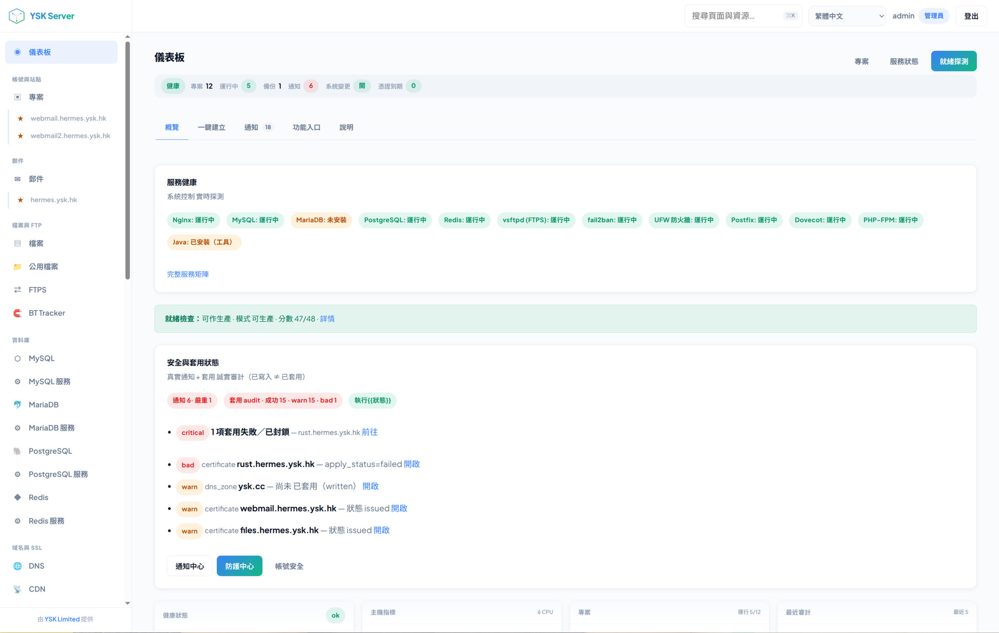
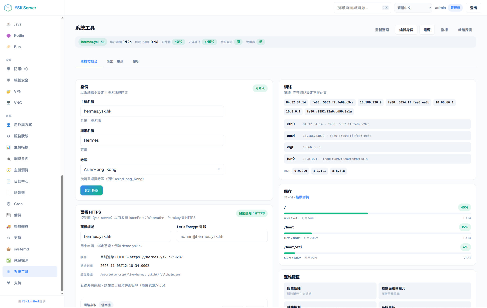

# YSK Server

> 語言：中文（香港書面語）| [English](./README.md)

**免費、開源、單機 Linux 控制平面** — 網頁面板 + CLI，管理你自己 VPS／實體機上的網站、檔案、電郵、資料庫、DNS／SSL、安全防護等。

| | |
|--|--|
| **版本** | **1.0.6** |
| **授權** | 免費公開使用（見倉庫授權） |
| **CLI** | `ysk-server` |
| **預設介面語系** | 繁中（香港）· 另有 en、簡中等 |
| **支援** | [email@ysk.hk](mailto:email@ysk.hk) · 面板 **Support** 頁 |

---

## 為什麼用 YSK Server？

- **伺服器係你自己嘅** — 唔係多租戶 SaaS 鎖死  
- **面板 + CLI + API** 同一核心（適合人手同 AI agent）  
- **誠實運維** — 改主機要 **root** + `YSK_EXECUTE=1`（唔會假成功）  
- **完整主機棧** — 專案、Nginx／Apache、SSL、資料庫、電郵、FTP、BT 分享、防護  

---

## 截圖

<p align="center">
  
</p>
<p align="center"><em>儀表板 — 服務健康、就緒檢查、安全與套用狀態</em></p>

<p align="center">
  
</p>
<p align="center"><em>系統工具 — 身份、面板 HTTPS、網絡與儲存</em></p>

---

## 安裝（裝完即可用）

建議 **Ubuntu 22.04／24.04**（其他 Linux：盡力支援）。請用 **root**：

```bash
curl -fsSL https://raw.githubusercontent.com/yanshekki/ysk-server/main/install.sh | bash -s -- --non-interactive
```

或從 npm（CLI 命令：`ysk-server`）：

```bash
npm install -g ysk-server
ysk-server setup
ysk-server serve
```

或從 git：

```bash
git clone https://github.com/yanshekki/ysk-server.git
cd ysk-server
sudo ./install.sh
```

安裝後（root 預設）：

1. **systemd** 已啟動 `ysk-server`  
2. 開啟 **`https://<伺服器IP>:9287`**（自簽憑證請於瀏覽器接受警告）  
3. 用安裝結尾打印嘅帳密登入（亦寫入 `$dataDir/BOOTSTRAP-CREDENTIALS.txt`）  
4. 改密碼 · 開 2FA  

卸載：

```bash
sudo ./uninstall.sh --all --keep-data --yes
# 連資料一併清除：
sudo ./uninstall.sh --all --purge-data --yes
```

完整選項： **[docs/getting-started/install-ZH.md](docs/getting-started/install-ZH.md)**  
卸載說明： **[docs/getting-started/uninstall-ZH.md](docs/getting-started/uninstall-ZH.md)**

---

## 你得到咩

| 範疇 | 重點 |
|------|------|
| **網站** | 專案、部署、隔離 |
| **檔案** | 管理、公開分享、WebDAV、FTP、**BT Tracker**／WebTorrent |
| **電郵** | 網域、郵箱、投遞檢查 |
| **資料** | MySQL／MariaDB／PostgreSQL／Redis |
| **邊緣** | DNS、SSL、Nginx、Apache、CDN agents |
| **安全** | 防護中心、SSH／2FA、VPN、VNC |
| **運維** | 指標、日誌、終端、Cron、備份、更新 |

細節全部喺 **[docs/INDEX-ZH.md](docs/INDEX-ZH.md)** — 功能手冊、CLI、架構請去文件。

---

## CLI 與 AI agent

```bash
ysk-server readiness --json
ysk-server help --locale zh-HK
export YSK_EXECUTE=1   # 真正改主機先要
```

- [docs/cli/reference-ZH.md](docs/cli/reference-ZH.md)  
- [docs/agent/README-ZH.md](docs/agent/README-ZH.md) · [docs/agent/commands.json](docs/agent/commands.json)  
- 專案 skill： [`.grok/skills/ysk-server/SKILL.md`](.grok/skills/ysk-server/SKILL.md)  

---

## 支持、贊助與專業服務

YSK Server **免費**畀所有人用。如果有幫助：

- 面板 **Support** 頁（`/support`）— Creator、贊助、加密貨幣地址  
- **[Linktree](https://linktr.ee/yanshekki)** · GitHub Sponsors  
- Crypto：`yanshekki.eth`（EVM）· `yanshekki.near` · `$yanshekki`（ADA）  
- 需要代管／加固／客製？**YSK Limited**（**此處不標價** — 請來信洽談）  
- 問題／回報：**[email@ysk.hk](mailto:email@ysk.hk)**  

---

## 開發者

```bash
pnpm install && pnpm build
# 詳見 docs/ — 唔喺 README 堆開發流程
```

---

## 誠實說明

- 安裝 **唔等於** 電郵／DNS 聲譽「一鍵保證入匣」。  
- 危險主機操作預設 dry-run，直至 `YSK_EXECUTE=1`。  
- 自簽面板憑證只為首次登入；有域名後請用 Let's Encrypt。  

---

**YSK Server** · 畀想自己掌控伺服器嘅人 · [ysk.hk](https://ysk.hk/) · [email@ysk.hk](mailto:email@ysk.hk)
