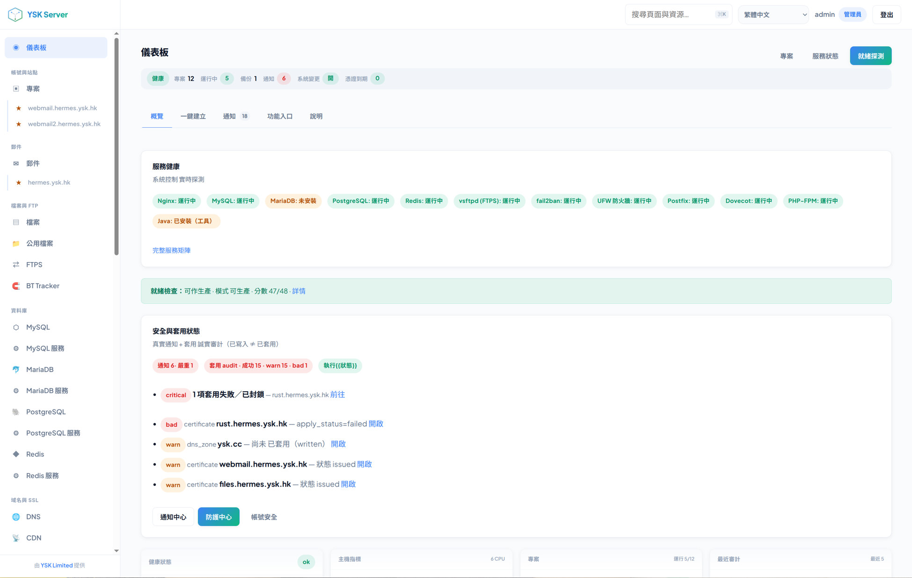
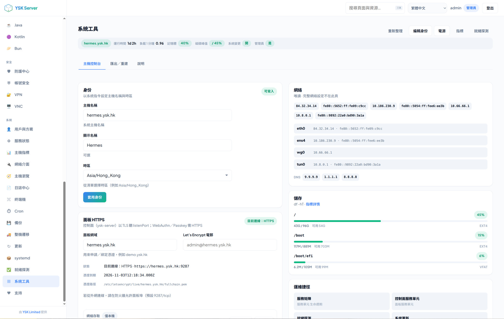

<p align="center">
  
</p>

<h1 align="center">YSK Server</h1>

<p align="center">
  <strong>給你自己主機用的 Linux 控制平面。</strong><br />
  網頁面板、CLI 與 API — 在一台 VPS 或實體機上管理網站、電郵、資料、邊緣與防護。
</p>

<p align="center">
  <a href="./README.md">English</a>
  ·
  <a href="https://ysk.hk/products/ysk-server">產品頁</a>
  ·
  <a href="https://ysk.hk/">ysk.hk</a>
  ·
  <a href="mailto:email@ysk.hk">email@ysk.hk</a>
  ·
  <a href="https://www.npmjs.com/package/ysk-server">npm</a>
</p>

<p align="center">
  <a href="https://www.npmjs.com/package/ysk-server"></a>
  <a href="https://github.com/yanshekki/ysk-server/actions/workflows/ci.yml"></a>
  
  
  
</p>

> 語言：**中文（香港書面語）** · [English](./README.md)

免費、開源、**單機**。不是多租戶面板即服務。你把它裝在自己的機器上；介面、`ysk-server` CLI 與 HTTP API 共用同一核心 — 亦適合 AI agent。

## 為什麼

| 主機屬於你 | 同一控制平面 | 誠實套用 | 生產堆疊 |
|:-----------|:-------------|:---------|:---------|
| 你操作的一台 Linux — VPS 或實體機 | 面板、CLI 與 API 同一模型 | 改主機需要 **root** + `YSK_EXECUTE=1`。預演不會報成功 | 網站、電郵、資料庫、DNS／SSL、防護、Docker |

## 1.1.27 新內容

### 安全
- 直接與傳遞依賴的供應鏈檢查。Vitest **4.1.11** 與 Vite **6.4.3** 清掉開發伺服器公告。`pnpm.overrides` 釘上已修補的 `brace-expansion`、`nanoid`、`ip-address`。報告：[docs/security/2026-10-05-supply-chain-ZH.md](docs/security/2026-10-05-supply-chain-ZH.md)。
- `install.sh` 安裝釘死的 `pnpm@9.15.9` 與 `node-gyp-build@4.8.4`（不再用 `pnpm@latest`，該輔助套件亦不再 `--force`）。GitHub Actions 釘在 commit SHA。

### 修正
- `install.sh` 完成橫額顯示實際安裝的 `ysk-server` 版本，不再寫死 `1.0.31`。
- 檔案系統時間戳沒有前進時，JsonStore 仍保留另一個行程寫入的資料列。

### 改進
- 安裝目標寫明 Ubuntu **22.04／24.04／26.04**（Debian 仍是盡力支援）。26.04 是一次 recommended 方案安裝後列入，不是完整 LTS 矩陣。

### 依賴升級
- 次版本升級包括 `ws`、`playwright-core`、`maxmind`、`sql.js`、`tsx`、`react-router-dom`，以及 TypeScript **5.9**。pnpm 維持 **9.15.9**。

### 內部／CI
- 標籤 `v*.*.*` 用 npm Trusted Publishing 發布（`.github/workflows/release.yml`）。本頁只保留最近三個版本。
- **套件** — `ysk-server`、`ysk-server-shared`、`ysk-server-core` 一齊出 **1.1.27**。

## 1.1.26 新內容

### 新功能
- **驗證者** — 節點起來後：NEAR 表單填好 `create_staking_pool`，並可只寫入 `account_id`；Cosmos 表單填好 gaiad v28 的 `validator.json`（不是 Hub 文件的 flags）；ETH 顯示 Lighthouse VC 示例或 beacon URL。

### 修正
- ADA（質押池註冊憑證）、AVAX（NodeID，不是 IP）、Solana（`--no-voting`）說明對齊官方流程。NEAR 確認顯示真實帳戶。Cosmos 金額接受 `1atom`。

### 依賴升級
- **套件** — `ysk-server`、`ysk-server-shared`、`ysk-server-core` 一齊出 **1.1.26**。

## 1.1.25 新內容

### 新功能
- **Cron** — 就地修改主機 crontab 行（`source=host`）。管理式任務：`ysk-server cron update --id`。
- **驗證者** — 節點起來後提供可複製的公開身份與後續步驟。CLI：`checklist`、`rewrite-compose`、`compose-write`、`software`、`pull`、`leftover-remove`、`stats`。

### 改進
- **語言** — 13 種語言的操作字串與說明分頁。zh-HK 為香港書面語。產品名稱維持英文。

### 修正
- NEAR／Cosmos 公布主機 P2P 埠。Cosmos gas 跟節點一致。質押指令列會換行。

### 依賴升級
- **套件** — `ysk-server`、`ysk-server-shared`、`ysk-server-core` 一齊出 **1.1.25**。

[完整變更紀錄](./CHANGELOG.zh.md)

## 面板

<p align="center">
  
</p>
<p align="center"><sub>儀表板 — 即時服務健康、就緒檢查與套用誠實度</sub></p>

<p align="center">
  
</p>
<p align="center"><sub>系統工具 — 身份、面板 HTTPS、網絡與儲存</sub></p>

## 安裝

建議 **Ubuntu 22.04／24.04／26.04**，以 **root** 執行。其他 Linux：盡力支援。

### 建議做法

```bash
curl -fsSL https://raw.githubusercontent.com/yanshekki/ysk-server/main/install.sh | bash -s -- --non-interactive
```

`install.sh` 會寫入 systemd 單元、啟動 TLS，並**一次性**打印管理員密碼。

### 安裝之後

1. 開啟 **`https://<伺服器IP>:9287`**（首次請接受自簽憑證警告）。
2. 以安裝結尾的帳密登入（亦寫在 `$dataDir/BOOTSTRAP-CREDENTIALS.txt`）。
3. 更改密碼。啟用 2FA。
4. 有域名後，為面板簽發受信任憑證。

### 其他方式

```bash
npm install -g ysk-server
sudo ysk-server setup --admin-user admin --admin-password 'YourStrongPass1!' --data-dir /var/lib/ysk-server
export YSK_EXECUTE=1
sudo ysk-server serve
```

預設弱密碼 `admin` 會被拒絕。全新主機請優先使用 `install.sh`。

```bash
git clone https://github.com/yanshekki/ysk-server.git
cd ysk-server
sudo ./install.sh
```

### 卸載

```bash
sudo ./uninstall.sh --all --keep-data --yes
# 連已登記資料一併清除：
sudo ./uninstall.sh --all --purge-data --yes
```

說明：[安裝](docs/getting-started/install-ZH.md) · [卸載](docs/getting-started/uninstall-ZH.md) · [文件目錄](docs/INDEX-ZH.md)

## 功能

| 範疇 | 已交付 |
|:-----|:-------|
| **網站** | 專案、Git 部署、逐站隔離 |
| **檔案** | 檔案管理、公開分享、WebDAV、FTPS、BT Tracker／WebTorrent |
| **電郵** | 網域、郵箱、投遞檢查（不保證全球入匣） |
| **資料** | MySQL、MariaDB、PostgreSQL、Redis |
| **邊緣** | DNS、SSL、Nginx、Apache、CDN agents |
| **安全** | 防護、SSH／2FA、VPN、VNC |
| **容器** | Docker 引擎 |
| **運維** | 指標、日誌、終端、cron、備份、更新 |
| **驗證者** | L1 節點（Beta） |

## CLI

```bash
ysk-server readiness --json
ysk-server help --locale zh-HK
export YSK_EXECUTE=1    # 真正改主機時必須
```

[CLI 參考](docs/cli/reference-ZH.md) · [agent 命令](docs/agent/commands.json) · [agent skill](.grok/skills/ysk-server/SKILL.md)

## 誠實說明

- 安裝面板**不等於**全球電郵入匣已保證。DNS、PTR 與 25 埠仍須自行處理。
- 危險主機操作維持**預演**，直至 `YSK_EXECUTE=1`。被阻擋的結果不是成功。
- 首次面板憑證為自簽。主機有域名後，請改用 Let’s Encrypt（或你自己的憑證）。

## 支援

YSK Server **免費**。若對你有幫助：

- 面板 **Support**（`/support`）— 作者、贊助、加密貨幣地址
- [Linktree](https://linktr.ee/yanshekki) · GitHub Sponsors
- 加密貨幣：`yanshekki.eth`（EVM）· `yanshekki.near` · `$yanshekki`（ADA）
- 需要代為操作： **YSK Limited** — 請來信（本頁不標價）
- 問題與回報：[email@ysk.hk](mailto:email@ysk.hk)
- 法律文件：[使用條款](./docs/legal/terms-ZH.md) · [私隱政策](./docs/legal/privacy-ZH.md) · [免責聲明](./docs/legal/disclaimer-ZH.md)（面板 `/legal`）

## 開發

```bash
pnpm install && pnpm build
pnpm --filter ysk-server exec node --import tsx/esm src/cli.ts setup --data-dir .ysk --json
pnpm --filter ysk-server exec node --import tsx/esm src/cli.ts serve --data-dir .ysk
```

架構與貢獻說明見 **[docs/](docs/INDEX-ZH.md)**。

---

<p align="center">
  <strong>YSK Server</strong> · 掌控自己的主機 ·
  <a href="https://ysk.hk/products/ysk-server">產品頁</a> ·
  <a href="https://ysk.hk/">ysk.hk</a> ·
  <a href="mailto:email@ysk.hk">email@ysk.hk</a>
</p>
