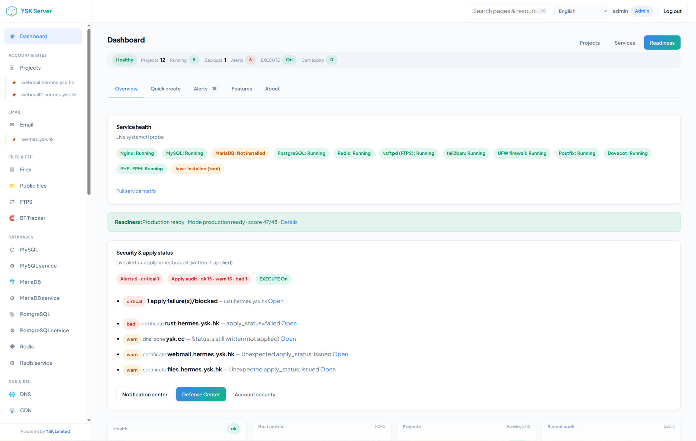
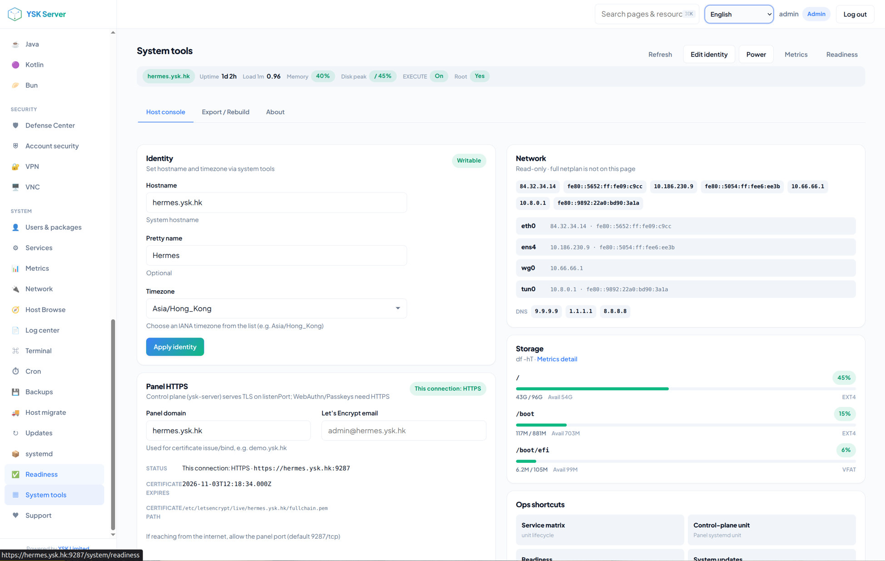

# YSK Server

> Language: English | [中文](./README-ZH.md)

**Free, open, single-host Linux control plane** — web panel + CLI to manage hosting, files, mail, databases, DNS/SSL, security, and more on **your** VPS or bare metal.

| | |
|--|--|
| **Version** | **1.0.0** |
| **License** | Free for public use (see repository license) |
| **CLI** | `ysk-server` |
| **Default UI locale** | zh-HK · also en, zh-CN, and more |
| **Support** | [email@ysk.hk](mailto:email@ysk.hk) · Panel **Support** page |

---

## Why YSK Server?

- **One server you own** — not multi-tenant SaaS lock-in  
- **Panel + CLI + API** share the same core (scriptable for humans and AI agents)  
- **Honest ops** — host changes need **root** + `YSK_EXECUTE=1` (no fake “success”)  
- **Hosting stack** — projects, Nginx/Apache, SSL, databases, email, FTP, BT shares, defense  

---

## Screenshots

<p align="center">
  
</p>
<p align="center"><em>Dashboard — service health, readiness, security &amp; apply status</em></p>

<p align="center">
  
</p>
<p align="center"><em>System tools — identity, panel HTTPS, network &amp; storage</em></p>

---

## Install (ready to use)

**Ubuntu 22.04 / 24.04** (other Linux: best-effort). Run as **root**:

```bash
curl -fsSL https://raw.githubusercontent.com/yanshekki/ysk-server/main/install.sh | bash -s -- --non-interactive
```

Or from npm (CLI bin: `ysk-server`):

```bash
npm install -g ysk-server
ysk-server setup
ysk-server serve
```

Or from git:

```bash
git clone https://github.com/yanshekki/ysk-server.git
cd ysk-server
sudo ./install.sh
```

After install (root defaults):

1. **systemd** starts `ysk-server`  
2. Open **`https://<server-ip>:9287`** (accept self-signed cert warning)  
3. Login with credentials printed at the end of install (also in `$dataDir/BOOTSTRAP-CREDENTIALS.txt`)  
4. Change password · enable 2FA  

Uninstall:

```bash
sudo ./uninstall.sh --all --keep-data --yes
# wipe data too:
sudo ./uninstall.sh --all --purge-data --yes
```

Full install options, plans, TLS flags: **[docs/getting-started/install.md](docs/getting-started/install.md)**  
Uninstall details: **[docs/getting-started/uninstall.md](docs/getting-started/uninstall.md)**

---

## What you get

| Area | Highlights |
|------|------------|
| **Sites** | Projects, deploy, isolation |
| **Files** | Manager, public shares, WebDAV, FTP, **BT Tracker** / WebTorrent |
| **Mail** | Domains, mailboxes, deliverability checks |
| **Data** | MySQL / MariaDB / PostgreSQL / Redis |
| **Edge** | DNS, SSL, Nginx, Apache, CDN agents |
| **Security** | Protection / defense, SSH/2FA, VPN, VNC |
| **Ops** | Metrics, logs, terminal, cron, backups, updates |

Everything is documented under **[docs/INDEX.md](docs/INDEX.md)** — start there for feature handbooks, CLI reference, and architecture.

---

## CLI & AI agents

```bash
ysk-server readiness --json
ysk-server help --locale en
export YSK_EXECUTE=1   # required for real host mutations
```

- [docs/cli/reference.md](docs/cli/reference.md)  
- [docs/agent/README.md](docs/agent/README.md) · [docs/agent/commands.json](docs/agent/commands.json)  
- Project skill: [`.grok/skills/ysk-server/SKILL.md`](.grok/skills/ysk-server/SKILL.md)  

---

## Support, donate & professional services

YSK Server is **free** for everyone. If it helps you:

- Panel **Support** page (`/support`) — Creator, donate, crypto handles  
- **[Linktree](https://linktr.ee/yanshekki)** · GitHub Sponsors  
- Crypto: `yanshekki.eth` (EVM) · `yanshekki.near` · `$yanshekki` (ADA)  
- Need hands-on help? **YSK Limited** (**no prices listed here** — contact us)  
- Bugs / questions: **[email@ysk.hk](mailto:email@ysk.hk)**  

---

## Development (contributors)

```bash
pnpm install && pnpm build
pnpm --filter ysk-server exec node --import tsx/esm src/cli.ts setup --data-dir .ysk --json
pnpm --filter ysk-server exec node --import tsx/esm src/cli.ts serve --data-dir .ysk
```

Architecture and contribution details live in **docs/** — not in this README.

---

## Honesty

- **Install ≠ full stack “set and forget” for mail/DNS reputation.**  
- Dangerous host operations are **dry-run by default** until `YSK_EXECUTE=1`.  
- Self-signed panel cert is for first login; replace with Let’s Encrypt when you have a domain.  

---

**YSK Server** · made for operators who want control · [ysk.hk](https://ysk.hk/) · [email@ysk.hk](mailto:email@ysk.hk)
