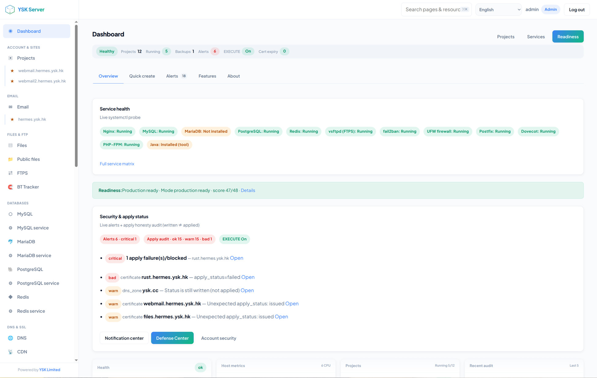
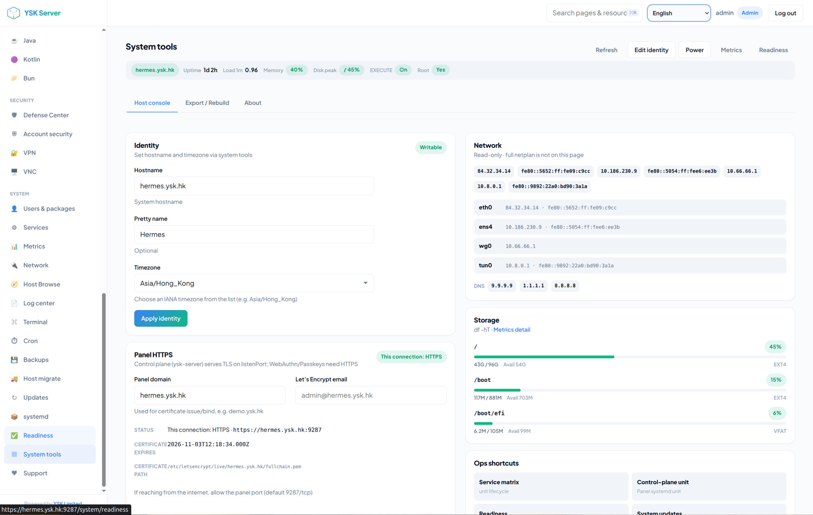

<p align="center">
  
</p>

<h1 align="center">YSK Server</h1>

<p align="center">
  <strong>The Linux control plane for a host you own.</strong><br />
  Web panel, CLI, and API — sites, mail, data, edge, and defense on one VPS or bare metal.
</p>

<p align="center">
  <a href="./README-ZH.md">中文</a>
  ·
  <a href="https://ysk.hk/products/ysk-server">Product page</a>
  ·
  <a href="https://ysk.hk/">ysk.hk</a>
  ·
  <a href="mailto:email@ysk.hk">email@ysk.hk</a>
  ·
  <a href="https://www.npmjs.com/package/ysk-server">npm</a>
</p>

<p align="center">
  <a href="https://www.npmjs.com/package/ysk-server"></a>
  <a href="https://github.com/yanshekki/ysk-server/actions/workflows/ci.yml"></a>
  
  
  
</p>

> Language: **English** · [中文（香港書面語）](./README-ZH.md)

Free, open, **single-host**. Not a multi-tenant panel-as-a-service. You install it on your machine; the same core drives the UI, `ysk-server` CLI, and HTTP API — including AI agents.

## Why

| Own the machine | One control plane | Honest apply | Production stack |
|:----------------|:------------------|:-------------|:-----------------|
| One Linux host you operate — VPS or bare metal | Panel, CLI, and API share one model | Host writes need **root** + `YSK_EXECUTE=1`. Dry-run never reports success | Sites, mail, databases, DNS/SSL, defense, Docker |

## What's new in 1.1.27

### Security
- Supply-chain pass for direct and transitive dependencies. Vitest **4.1.11** and Vite **6.4.3** clear the dev-server advisories. `pnpm.overrides` pin patched `brace-expansion`, `nanoid`, and `ip-address`. Report: [docs/security/2026-10-05-supply-chain.md](docs/security/2026-10-05-supply-chain.md).
- `install.sh` installs pinned `pnpm@9.15.9` and `node-gyp-build@4.8.4` (not `pnpm@latest`, and not `--force` for that helper). GitHub Actions are pinned to commit SHAs.

### Fixes
- `install.sh` finish banner reports the installed `ysk-server` version, not a frozen `1.0.31`.
- JsonStore keeps another process's rows when the filesystem timestamp does not move between writes.

### Improvements
- Install targets are documented as Ubuntu **22.04 / 24.04 / 26.04** (Debian remains best-effort). 26.04 is listed after one recommended-plan install, not a full LTS matrix.

### Dependency upgrades
- Minor bumps include `ws`, `playwright-core`, `maxmind`, `sql.js`, `tsx`, `react-router-dom`, and TypeScript **5.9**. pnpm stays on **9.15.9**.

### Internal & CI
- Tag `v*.*.*` publishes with npm Trusted Publishing (`.github/workflows/release.yml`). This page keeps the latest three versions.
- **Packages** — `ysk-server`, `ysk-server-shared`, and `ysk-server-core` ship **1.1.27** together.

## What's new in 1.1.26

### New features
- **Validators** — after the node is up: NEAR form fills `create_staking_pool` and can write `account_id` only; Cosmos form fills gaiad v28 `validator.json` (not Hub-docs flags); ETH shows a Lighthouse VC example or the beacon URL.

### Fixes
- Honest copy for ADA (pool registration certificate), AVAX (NodeID, not IP), and Solana (`--no-voting`). NEAR confirm shows the real account. Cosmos amount accepts `1atom`.

### Dependency upgrades
- **Packages** — `ysk-server`, `ysk-server-shared`, and `ysk-server-core` ship **1.1.26** together.

## What's new in 1.1.25

### New features
- **Cron** — in-place edit for live host crontab lines (`source=host`). Managed jobs: `ysk-server cron update --id`.
- **Validators** — copyable public identity and next steps after the node is up. CLI: `checklist`, `rewrite-compose`, `compose-write`, `software`, `pull`, `leftover-remove`, `stats`.

### Improvements
- **Locales** — operator strings and About-tab guides for all 13 languages. zh-HK is Hong Kong written Chinese. Product names stay English.

### Fixes
- NEAR / Cosmos advertise the host P2P port. Cosmos gas matches the node. Staking command rows wrap.

### Dependency upgrades
- **Packages** — `ysk-server`, `ysk-server-shared`, and `ysk-server-core` ship **1.1.25** together.

[Full changelog](./CHANGELOG.md)

## Panel

<p align="center">
  
</p>
<p align="center"><sub>Dashboard — live service health, readiness, and apply honesty</sub></p>

<p align="center">
  
</p>
<p align="center"><sub>System tools — identity, panel HTTPS, network, and storage</sub></p>

## Install

**Ubuntu 22.04 / 24.04 / 26.04** as **root**. Other Linux: best-effort.

### Recommended

```bash
curl -fsSL https://raw.githubusercontent.com/yanshekki/ysk-server/main/install.sh | bash -s -- --non-interactive
```

`install.sh` writes the systemd unit, bootstrap TLS, and prints a **one-time** admin password.

### After install

1. Open **`https://<server-ip>:9287`** (accept the self-signed warning once).
2. Sign in with the credentials at the end of install (also `$dataDir/BOOTSTRAP-CREDENTIALS.txt`).
3. Change the password. Turn on 2FA.
4. Issue a trusted panel certificate when you have a domain.

### Other ways

```bash
npm install -g ysk-server
sudo ysk-server setup --admin-user admin --admin-password 'YourStrongPass1!' --data-dir /var/lib/ysk-server
export YSK_EXECUTE=1
sudo ysk-server serve
```

Weak default `admin` is rejected. Prefer `install.sh` on a fresh host.

```bash
git clone https://github.com/yanshekki/ysk-server.git
cd ysk-server
sudo ./install.sh
```

### Uninstall

```bash
sudo ./uninstall.sh --all --keep-data --yes
# also wipe registered data:
sudo ./uninstall.sh --all --purge-data --yes
```

Guides: [install](docs/getting-started/install.md) · [uninstall](docs/getting-started/uninstall.md) · [docs index](docs/INDEX.md)

## Capabilities

| Area | What ships |
|:-----|:-----------|
| **Sites** | Projects, Git deploy, per-site isolation |
| **Files** | File manager, public shares, WebDAV, FTPS, BT Tracker / WebTorrent |
| **Mail** | Domains, mailboxes, deliverability checks (inbox reputation is not guaranteed) |
| **Data** | MySQL, MariaDB, PostgreSQL, Redis |
| **Edge** | DNS, SSL, Nginx, Apache, CDN agents |
| **Security** | Protection, SSH / 2FA, VPN, VNC |
| **Containers** | Docker engine |
| **Ops** | Metrics, logs, terminal, cron, backups, updates |
| **Validators** | L1 nodes (Beta) |

## CLI

```bash
ysk-server readiness --json
ysk-server help --locale en
export YSK_EXECUTE=1    # required for real host mutations
```

[CLI reference](docs/cli/reference.md) · [agent commands](docs/agent/commands.json) · [agent skill](.grok/skills/ysk-server/SKILL.md)

## Honesty

- Installing the panel **does not** make global mail inbox delivery a given. DNS, PTR, and port 25 are still yours.
- Dangerous host operations stay **dry-run** until `YSK_EXECUTE=1`. A blocked result is not success.
- The first panel certificate is self-signed. Replace it with Let’s Encrypt (or your own) when the host has a name.

## Support

YSK Server is **free**. If it helps:

- Panel **Support** (`/support`) — creator, donate, crypto handles
- [Linktree](https://linktr.ee/yanshekki) · GitHub Sponsors
- Crypto: `yanshekki.eth` (EVM) · `yanshekki.near` · `$yanshekki` (ADA)
- Hands-on work: **YSK Limited** — write to us (no prices on this page)
- Bugs and questions: [email@ysk.hk](mailto:email@ysk.hk)
- Legal: [Terms](./docs/legal/terms.md) · [Privacy](./docs/legal/privacy.md) · [Disclaimer](./docs/legal/disclaimer.md) (panel `/legal`)

## Development

```bash
pnpm install && pnpm build
pnpm --filter ysk-server exec node --import tsx/esm src/cli.ts setup --data-dir .ysk --json
pnpm --filter ysk-server exec node --import tsx/esm src/cli.ts serve --data-dir .ysk
```

Architecture and contribution notes live under **[docs/](docs/INDEX.md)**.

---

<p align="center">
  <strong>YSK Server</strong> · control without a landlord ·
  <a href="https://ysk.hk/products/ysk-server">Product page</a> ·
  <a href="https://ysk.hk/">ysk.hk</a> ·
  <a href="mailto:email@ysk.hk">email@ysk.hk</a>
</p>
