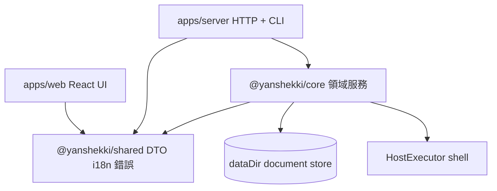

# 架構概覽

> 語言：中文 | [English](./overview.md)

**讀者：** 操作員與工程師  
**相關：** [monorepo-ZH](./monorepo-ZH.md) · [ops-honesty-ZH](./ops-honesty-ZH.md) · [state-store-ZH](./state-store-ZH.md)

## 產品定位

YSK Server 是**單機控制平面**：一部 Linux、多個站點／應用、同一面板與 CLI。**不是**多租戶 Reseller SaaS。

## 分層



| 層 | 套件／路徑 | 職責 |
|----|------------|------|
| 契約 | `@yanshekki/shared` | DTO、ops 型別、錯誤、語言包 |
| 領域 | `@yanshekki/core` | 架站、郵件、安全、檔案、監控… |
| 邊界 | `apps/server` | 薄 HTTP 路由 + CLI → core |
| 介面 | `apps/web` | React 面板；i18n 來自 shared |

### 依賴規則

```
Web / CLI / HTTP  →  @yanshekki/shared（型別 + i18n）
HTTP / CLI        →  @yanshekki/core
@yanshekki/core         →  只依賴 @yanshekki/shared
```

業務規則不寫在純 UI 或空殼路由。

## HTTP 與 CLI

- **HTTP：** `http-server.ts` 分派至 `routes/*`。  
- **CLI：** 同一 `createAppContext` + core；優先 `--json`。  
- **認證：** session + API 金鑰（`ysk_*`）；請求語言：`Accept-Language`／`--locale`。

## 主機變更模型

| 閘門 | 含義 |
|------|------|
| `YSK_EXECUTE=1` | 允許真實主機命令 |
| root（常見） | useradd、apt、系統 nginx 等 |
| CLI 預設 | **dry-run**，直至 `--execute`／`--apply` |

管理設定多半先寫入 **`dataDir`**（`written`），有 EXECUTE 才複製／reload（`applied`）。

## 安全摘要

- 密碼政策、TOTP、復原碼、WebAuthn、API 金鑰  
- 變更路由 RBAC（預設 fail-closed）  
- 高危工具 allowlist + 審批  
- 審計日誌  

詳見：[../security/overview-ZH.md](../security/overview-ZH.md)。

## 國際化

預設 **zh-HK**（香港書面語）；另有 **zh-CN**、**en**。  
唯一真相：`packages/shared/locales/`。見 [../i18n-ZH.md](../i18n-ZH.md)。
