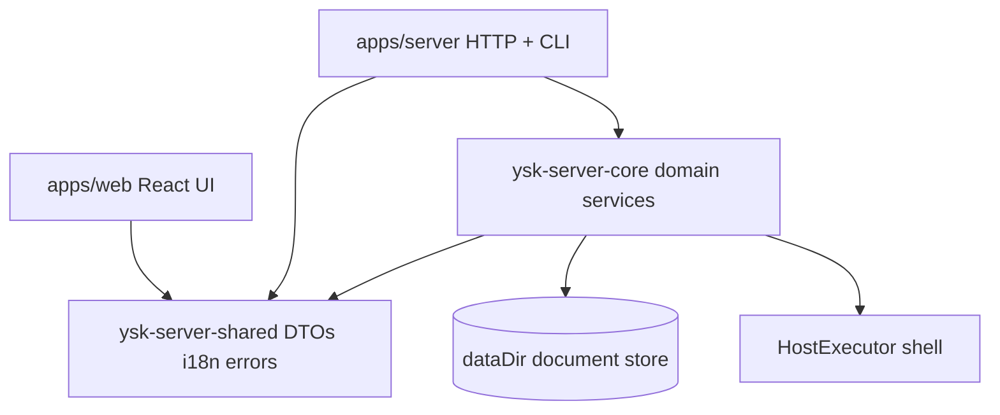

# Architecture overview

> Language: English | [中文](./overview-ZH.md)

**Audience:** operators and engineers  
**Related:** [monorepo](./monorepo.md) · [ops-honesty](./ops-honesty.md) · [state-store](./state-store.md)

## Product position

YSK Server is a **single-host control plane**: one Linux machine, many sites/apps, one panel + CLI. It is **not** multi-tenant reseller SaaS.

## Layers



| Layer | Package / path | Role |
|-------|----------------|------|
| Contracts | `ysk-server-shared` | DTOs, ops types, errors, i18n catalogs |
| Domain | `ysk-server-core` | hosting, email, security, files, monitoring… |
| Edge | `apps/server` | Thin HTTP routes + CLI → core |
| UI | `apps/web` | React panel; i18n from shared locales |

### Dependency rule

```
Web / CLI / HTTP  →  ysk-server-shared (types + i18n)
HTTP / CLI        →  ysk-server-core
ysk-server-core         →  ysk-server-shared only
```

No business rules inside pure UI or route shells.

## HTTP + CLI

- **HTTP:** `http-server.ts` dispatches to `routes/*` (auth, email, hosting, …).  
- **CLI:** same `createAppContext` + core services; prefers `--json`.  
- **Auth:** sessions + API keys (`ysk_*`); request locale via `Accept-Language` / `--locale`.

## Host mutation model

| Gate | Meaning |
|------|---------|
| `YSK_EXECUTE=1` | Allow real host commands |
| root (often) | `useradd`, apt, system nginx, etc. |
| CLI default | **dry-run** until `--execute` / `--apply` |

Managed configs usually land under **`dataDir`** first (`written`), then copy/reload when EXECUTE allows (`applied`).

## Security sketch

- Password policy, TOTP, recovery, WebAuthn paths, API keys  
- RBAC capabilities on mutating routes (fail-closed default)  
- Allowlist + approval for high-risk tools  
- Audit log  

Details: [../security/overview.md](../security/overview.md).

## i18n

Default **zh-HK** (Hong Kong written Chinese); also **zh-CN**, **en**.  
Single source: `packages/shared/locales/`. See [../i18n.md](../i18n.md).
